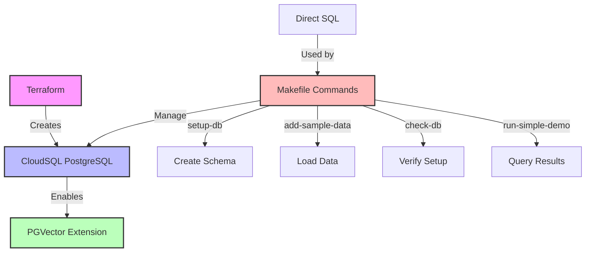

<div align="center">

# 🚀 PGVector on CloudSQL for GCP

### A simplified infrastructure setup for vector-based applications using PostgreSQL with PGVector extension on Google Cloud SQL

[](https://www.postgresql.org/)
[](https://cloud.google.com/)
[](https://www.terraform.io/)

</div>

## 📑 Table of Contents


- [🚀 PGVector on CloudSQL for GCP](#-pgvector-on-cloudsql-for-gcp)
    - [A simplified infrastructure setup for vector-based applications using PostgreSQL with PGVector extension on Google Cloud SQL](#a-simplified-infrastructure-setup-for-vector-based-applications-using-postgresql-with-pgvector-extension-on-google-cloud-sql)
  - [📑 Table of Contents](#-table-of-contents)
  - [📋 Overview](#-overview)
  - [✨ Key Features](#-key-features)
    - [🏗️ Infrastructure as Code](#️-infrastructure-as-code)
    - [🔄 Simplified Operations](#-simplified-operations)
    - [🌐 Multi-Environment Support](#-multi-environment-support)
    - [🚀 Quick Setup](#-quick-setup)
  - [📋 Prerequisites](#-prerequisites)
  - [📂 Project Structure](#-project-structure)
  - [🌍 Environment Configuration](#-environment-configuration)
  - [🚦 Getting Started](#-getting-started)
  - [🧩 Core Components](#-core-components)
  - [📊 Architecture](#-architecture)
    - [Simplified Overview](#simplified-overview)
    - [High-Level Architecture Diagram](#high-level-architecture-diagram)
  - [🏗️ Terraform Infrastructure Details](#️-terraform-infrastructure-details)
    - [Environment Differences](#environment-differences)
    - [Deployment Steps](#deployment-steps)
    - [Database Access Details](#database-access-details)
    - [Configuration Notes](#configuration-notes)
  - [🛠️ Other Common Tasks](#️-other-common-tasks)
    - [🔌 Connect to the database directly](#-connect-to-the-database-directly)
    - [🔍 Check database status](#-check-database-status)
    - [🧹 Clean up resources](#-clean-up-resources)
  - [🌐 Using Different Environments](#-using-different-environments)
  - [❓ Troubleshooting](#-troubleshooting)
  - [📚 Additional Resources](#-additional-resources)
    - [📘 PGVector Documentation](#-pgvector-documentation)
    - [☁️ Google Cloud SQL](#️-google-cloud-sql)
    - [🏗️ Terraform](#️-terraform)
  - [📄 License](#-license)

## 📋 Overview

This project demonstrates how to:

1. 🛢️ Set up a PostgreSQL database on Google Cloud SQL with the PGVector extension
2. 📊 Create database tables to store data with vector embeddings
3. 🔍 Perform simple queries to interact with vectorized data
4. ⚙️ Scale infrastructure across development, pre-production, and production environments

This infrastructure can support a variety of vector-based applications and use cases.

<details>
<summary><b>🚀 Quick Start (for the impatient)</b></summary>

```bash
# Clone the repo
git clone https://github.com/sciences44/pgvector_cloudsql_gcp.git
cd pgvector_cloudsql_gcp

# Setup environment
cp .env.example .env
# Edit .env with your credentials

# Copy and edit Terraform variables
cp terraform-sql/environments/dev/terraform.tfvars.example terraform-sql/environments/dev/terraform.tfvars
# Edit terraform.tfvars with your specific configuration values

# Install dependencies
make install-deps

# Initialize and create infrastructure
make tf-init ENV=dev
make tf-apply ENV=dev

# Setup database and run demo
make setup-db ENV=dev
make add-sample-data ENV=dev
make run-simple-demo ENV=dev
```

See [🚦 Getting Started](#-getting-started) for detailed instructions and [🏗️ Terraform Infrastructure Details](#️-terraform-infrastructure-details) for more deployment options.

</details>

## ✨ Key Features

<div class="feature-grid" style="display: grid; grid-template-columns: repeat(auto-fit, minmax(300px, 1fr)); gap: 1rem;">

<div class="feature-card">

### 🏗️ Infrastructure as Code
Terraform-based provisioning of Google Cloud SQL PostgreSQL instances
</div>

<div class="feature-card">

### 🔄 Simplified Operations
All database operations managed directly through Makefile commands
</div>

<div class="feature-card">

### 🌐 Multi-Environment Support
Development, pre-production, and production configurations
</div>

<div class="feature-card">

### 🚀 Quick Setup
Easy-to-follow setup process with clear documentation
</div>

</div>

## 📋 Prerequisites

- [ ] Google Cloud Platform account with billing enabled
- [ ] [Terraform](https://www.terraform.io/downloads.html) (v1.0.0+)
- [ ] PostgreSQL client tools (`psql`)
- [ ] Basic understanding of SQL and GCP concepts

## 📂 Project Structure

<details open>
<summary><b>Folder Organization</b></summary>

```
.
├── 📄 Makefile                # Main command interface for all operations
├── 📁 terraform-sql/          # Terraform configuration for Cloud SQL
│   ├── 📁 environments/       # Environment-specific configurations
│   │   ├── 📁 dev/            # Development environment
│   │   ├── 📁 preprod/        # Pre-production environment
│   │   └── 📁 prod/           # Production environment
│   └── 📁 modules/            # Reusable Terraform modules
│       ├── 📁 project/        # GCP project configuration
│       ├── 📁 sql/            # Cloud SQL instance configuration
│       └── 📁 vpc/            # Network configuration
└── 📁 how_to_tutorials/       # Example applications and demos
    └── 📁 semantic_demo/      # (Legacy) Semantic search demo for product recommendations
```

</details>

## 🌍 Environment Configuration

The system supports three environments:

| Environment | Description |
|-------------|-------------|
| 🧪 **dev** | Development environment with public IP access for easier development |
| 🔄 **preprod** | Pre-production environment with private access only |
| 🏭 **prod** | Production environment with private access only and enhanced reliability |

You can check your current environment settings with:

```bash
make env
```

This will display the environment, database user, and password status.

## 🚦 Getting Started

This section provides a detailed walkthrough for setting up your environment and running the project.

<details open>
<summary><b>1. Set up environment</b></summary>

```bash
# Copy and edit the environment file
cp .env.example .env
```

Edit `.env` with your credentials.
</details>

<details open>
<summary><b>2. Install dependencies</b></summary>

```bash
make install-deps
```
</details>

<details open>
<summary><b>3. Set up the database</b></summary>

Once your infrastructure is deployed (see [Terraform Infrastructure Details](#️-terraform-infrastructure-details)), you can set up the database:

```bash
# Create database tables and structure
make setup-db ENV=dev

# Add sample product data
make add-sample-data ENV=dev

# Verify database setup
make check-db ENV=dev
```
</details>

<details open>
<summary><b>4. Run the simple demo</b></summary>

```bash
make run-simple-demo ENV=dev
```
</details>

## 🧩 Core Components

<details open>
<summary><b>1. Infrastructure (Terraform)</b></summary>

The `terraform-sql` directory contains all the necessary Terraform configurations to set up:

- 🛢️ PostgreSQL instances on Google Cloud SQL
- 🔒 Network configuration (VPC, firewall rules)
- 👤 IAM permissions and service accounts
</details>

<details open>
<summary><b>2. Database Operations (Makefile)</b></summary>

The project uses a streamlined approach with Makefile commands that directly execute PostgreSQL operations:

| Command | Description |
|---------|-------------|
| `make setup-db ENV=dev` | Create database schema with pgvector extension |
| `make add-sample-data ENV=dev` | Add sample product data |
| `make check-db ENV=dev` | Verify database connectivity and content |
| `make run-simple-demo ENV=dev` | Execute simple queries to view data |
</details>

<details open>
<summary><b>3. Potential Use Cases</b></summary>

This infrastructure can support various vector-based applications:

| Use Case | Description |
|----------|-------------|
| 🛒 **Product Recommendations** | Deliver personalized suggestions using semantic similarity |
| 🤖 **Retrieval-Augmented Generation (RAG)** | Enhance chatbots and LLMs with context-aware retrieval |
| 🔍 **Semantic Search** | Go beyond keywords to find relevant documents, products, or answers |
| 🧹 **Content Deduplication** | Identify near-duplicate items in large datasets |
| 🚨 **Anomaly Detection** | Spot unusual patterns by comparing vector representations |
| 🎯 **Personalization Engines** | Tailor user experiences based on semantic profiles |
</details>

## 📊 Architecture

### Simplified Overview

<div align="center">



</div>

### High-Level Architecture Diagram

This diagram provides a comprehensive architecture overview of the infrastructure solution for deploying PostgreSQL with the pgvector extension on Google Cloud Platform.

```mermaid
graph TD
    %% Main components
    User([User/Developer]) --> |Uses| Makefile
    Makefile --> |Executes| TerraformCommands
    
    subgraph "Repository Structure"
        Makefile[/"Makefile\nMain command interface"/]
        TerraformDir["terraform-sql/\nTerraform configurations"]
        EnvDir["environments/\nEnvironment configs"]
        ModulesDir["modules/\nReusable modules"]
        TutorialsDir["how_to_tutorials/\nExample applications"]
        
        TerraformDir --> EnvDir
        TerraformDir --> ModulesDir
    end
    
    subgraph "Environment Configurations"
        EnvDir --> DevEnv["dev/\nDevelopment environment"]
        EnvDir --> PreprodEnv["preprod/\nPre-production environment"]
        EnvDir --> ProdEnv["prod/\nProduction environment"]
    end
    
    subgraph "Terraform Modules"
        ModulesDir --> ProjectModule["project/\nGCP project setup"]
        ModulesDir --> VPCModule["vpc/\nNetwork configuration"]
        ModulesDir --> SQLModule["sql/\nCloud SQL configuration"]
    end
    
    subgraph "Terraform Commands"
        TerraformCommands[/"Terraform Operations"/]
        TerraformCommands --> TFInit["terraform init"]
        TerraformCommands --> TFPlan["terraform plan"]
        TerraformCommands --> TFApply["terraform apply"]
        TerraformCommands --> TFDestroy["terraform destroy"]
    end
    
    subgraph "Database Commands"
        Makefile --> |Executes| DBCommands[/"Database Operations"/]
        DBCommands --> SetupDB["make setup-db\nCreates schema & pgvector"]
        DBCommands --> SampleData["make add-sample-data\nLoads sample data"]
        DBCommands --> CheckDB["make check-db\nVerifies setup"]
        DBCommands --> RunDemo["make run-simple-demo\nRuns example queries"]
    end
    
    %% GCP Resources Created
    subgraph "GCP Resources"
        ProjectModule --> GCPProject["GCP Project"]
        GCPProject --> APIs["Enabled APIs\nCloud SQL, IAM, Compute"]
        GCPProject --> ServiceAccts["Service Accounts"]
        
        VPCModule --> VPCNetwork["Custom VPC Network"]
        VPCModule --> FirewallRules["Firewall Rules"]
        VPCModule --> PrivateAccess["Private Service Access"]
        
        SQLModule --> CloudSQL["Cloud SQL PostgreSQL Instance"]
        CloudSQL --> PGVector["pgvector Extension"]
        PGVector --> VectorDB["Vector Database\nwith indexes"]
    end
    
    %% Environment-specific configurations
    DevEnv --> |Configures| DevResources["Public IP\nOpen firewall\nLower specs\nZONAL"]
    PreprodEnv --> |Configures| PreprodResources["Private IP\nVPC network\nMedium specs\nZONAL"]
    ProdEnv --> |Configures| ProdResources["Private IP\nStrict VPC\nHigher specs\nREGIONAL\nBackups"]
    
    DevResources --> |Applied to| GCPProject
    PreprodResources --> |Applied to| GCPProject
    ProdResources --> |Applied to| GCPProject
    
    %% Data flow for applications
    VectorDB --> |Powers| Applications["Vector Search Applications"]
    Applications --> |Uses| UseCases["Use Cases:\nProduct Recommendations\nSemantic Search\nRAG\nContent Deduplication"]
    
    %% Styling
    classDef module fill:#b8e0d2,stroke:#333,stroke-width:2px
    classDef resource fill:#d6eaf8,stroke:#333,stroke-width:1px
    classDef command fill:#f9e79f,stroke:#333,stroke-width:1px
    classDef environment fill:#d5f5e3,stroke:#333,stroke-width:1px
    classDef security fill:#fadbd8,stroke:#333,stroke-width:1px
    
    class ProjectModule,VPCModule,SQLModule module
    class GCPProject,APIs,ServiceAccts,VPCNetwork,FirewallRules,PrivateAccess,CloudSQL,PGVector,VectorDB resource
    class TerraformCommands,DBCommands,SetupDB,SampleData,CheckDB,RunDemo command
    class DevEnv,PreprodEnv,ProdEnv,DevResources,PreprodResources,ProdResources environment
    class FirewallRules,PrivateAccess security
```



This project uses a simplified approach:

1. 🏗️ **Terraform** creates the CloudSQL PostgreSQL infrastructure
2. 🔄 **Makefile commands** handle all database operations:
   - `setup-db`: Creates the pgvector extension and required tables
   - `add-sample-data`: Adds example product data
   - `check-db`: Verifies database setup and counts products
   - `run-simple-demo`: Shows simple query results
3. 📝 **Direct SQL** commands are used instead of Python scripts, simplifying maintenance

## 🏗️ Terraform Infrastructure Details

<details open>
<summary><b>Directory Structure</b></summary>

```
terraform-sql/
├── modules/                      # Reusable Terraform modules
│   ├── project/                  # Project creation module
│   ├── sql/                      # CloudSQL PostgreSQL module 
│   └── vpc/                      # VPC network module
└── environments/                 # Environment-specific configurations
    ├── dev/                      # Development environment
    ├── preprod/                  # Pre-production environment
    └── prod/                     # Production environment
```
</details>

### Environment Differences

<div align="center">

| Environment | Access | Network | Resources | Availability | Protection |
|:-----------:|:------:|:-------:|:---------:|:------------:|:----------:|
| 🧪 **dev** | Public IP | Open firewall | Lower specs | ZONAL | No deletion protection |
| 🔄 **preprod** | Private IP only | VPC network | Medium specs | ZONAL | No deletion protection |
| 🏭 **prod** | Private IP only | Strict VPC | Higher specs | REGIONAL | Deletion protection + backups |

</div>

### Deployment Steps

Follow these steps to create the infrastructure required for this project:

<details open>
<summary><b>1. Configure environment variables</b></summary>

```bash
# Copy the example variables file
cp terraform-sql/environments/dev/terraform.tfvars.example terraform-sql/environments/dev/terraform.tfvars
```

Edit this file with your specific configuration values.
</details>

<details open>
<summary><b>2. Initialize Terraform</b></summary>

```bash
# Initialize Terraform for your chosen environment
make tf-init ENV=dev
```

This will check if terraform.tfvars exists and create it from the example file if needed.
</details>

<details open>
<summary><b>3. Deploy the environment</b></summary>

```bash
# Review what will be created/changed
make tf-plan ENV=dev

# Apply the changes
make tf-apply ENV=dev
```
</details>

<details open>
<summary><b>4. Clean up when done</b></summary>

```bash
# To destroy all resources (will ask for confirmation)
make tf-destroy ENV=dev

# To clean up Terraform files
make tf-clean ENV=dev
```
</details>

Once your infrastructure is deployed, return to [Getting Started](#-getting-started) to set up your database and run the demo.

### Database Access Details

<details open>
<summary><b>🧪 Development Environment Access</b></summary>

In the development environment, you can access the database directly through its public IP:

```ini
Host: <public_ip_output>
Port: 5432
Database: <database_name_output>
User: <configured_username>
Password: <configured_password>
```
</details>

<details open>
<summary><b>🔄 Pre-production/🏭 Production Environment Access</b></summary>

For preprod and prod environments, you must connect through private IP from a machine within the VPC network:

```ini
Host: <private_ip_output>
Port: 5432
Database: <database_name_output>
User: <configured_username>
Password: <configured_password>
```

> **Note:** You'll need to set up a bastion host or use Cloud SQL Auth Proxy to connect to these environments.
</details>

### Configuration Notes

<div class="config-notes" style="background-color: #f8f9fa; padding: 15px; border-radius: 5px; border-left: 4px solid #4285F4;">

| Area | Recommendation |
|:-----|:---------------|
| 🔒 **Firewall Rules** | The dev environment creates permissive firewall rules. Consider restricting them further for increased security. |
| 🔑 **Passwords** | Use secure passwords and consider implementing Secret Manager for production. |
| 🌐 **Network Design** | Consider connecting the VPC to your existing networks using VPC peering. |

</div>

## 🛠️ Other Common Tasks

<div class="grid" style="display: grid; grid-template-columns: repeat(auto-fit, minmax(300px, 1fr)); gap: 1rem;">

<div class="card">

### 🔌 Connect to the database directly

```bash
make connect-db ENV=dev
```
</div>

<div class="card">

### 🔍 Check database status

```bash
make check-db ENV=dev
```
</div>

<div class="card">

### 🧹 Clean up resources

```bash
make tf-destroy ENV=dev
```
</div>

</div>

## 🌐 Using Different Environments

<div align="center">

| Environment | Command |
|-------------|---------|
| 🧪 Development | `make run-simple-demo ENV=dev` |
| 🔄 Pre-production | `make run-simple-demo ENV=preprod` |
| 🏭 Production | `make run-simple-demo ENV=prod` |

</div>

## ❓ Troubleshooting

<details>
<summary><b>Common Issues & Solutions</b></summary>

| Issue | Solution |
|-------|----------|
| ❌ Connection issues in dev | ✅ Check that the public IP is accessible |
| ❌ Cannot connect to preprod/prod | ✅ Remember that private connections require VPC network access |
| ❌ Database structure issues | ✅ Run `make check-db ENV=dev` to verify connectivity and structure |
| ❌ Environment configuration problems | ✅ Run `make env` to check your current configuration |
| ❌ Need to reset tables | ✅ Connect directly with `make connect-db ENV=dev` and run DROP statements manually |

</details>

## 📚 Additional Resources

<div class="resources-grid" style="display: grid; grid-template-columns: repeat(auto-fit, minmax(300px, 1fr)); gap: 1rem;">

<div class="resource-card">

### 📘 PGVector Documentation
[Official PGVector Documentation](https://github.com/pgvector/pgvector)
</div>

<div class="resource-card">

### ☁️ Google Cloud SQL
[Cloud SQL Documentation](https://cloud.google.com/sql/docs/postgres)
</div>

<div class="resource-card">

### 🏗️ Terraform
[Terraform Documentation](https://www.terraform.io/docs)
</div>


</div>

## 📄 License

[](LICENSE)

---

<div align="center">
<p>Made with ❤️ for vector database enthusiasts</p>

<a href="https://github.com/sciences44/pgvector_cloudsql_gcp/stargazers">
  
</a>
</div>
